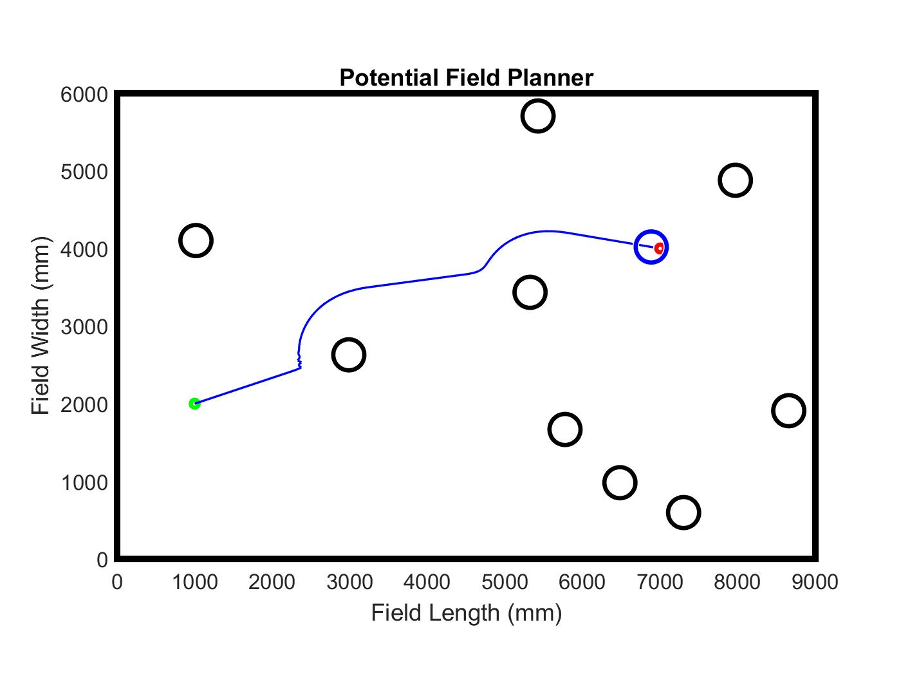
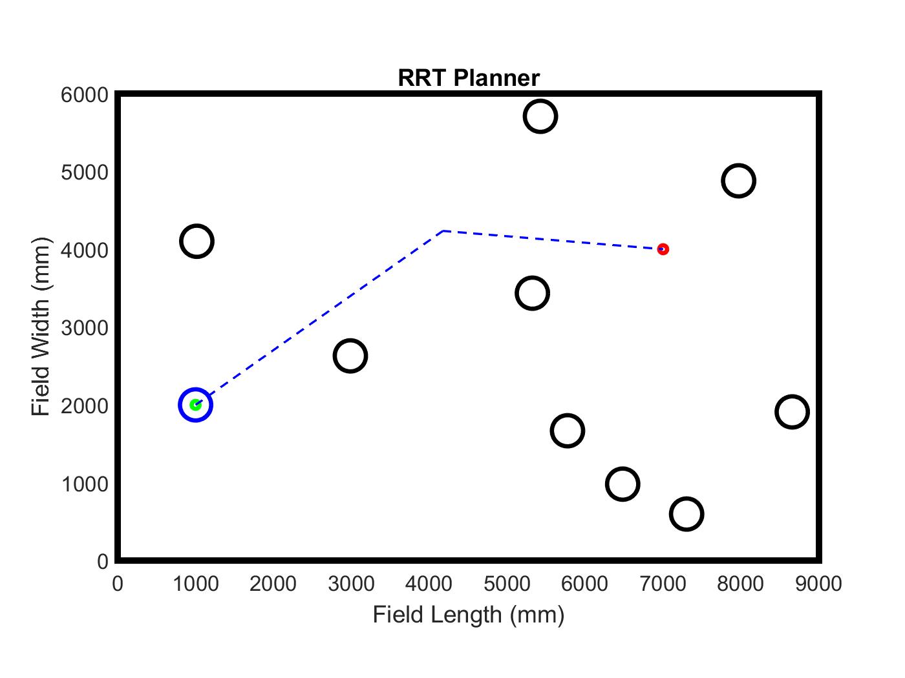

# P-RRT_Planner

## Summary

This project combines artificial potential fields (APF) and a rapdily-exploring random tree (RRT) in a 2D environment for a holonomic vehicle. The intent of this approach is to utilize RRTs when trapped in local minima that would otherwise be prohibitive for an APF to escape while preserving the APF's ability to nicely handle dynamic obstacles. Roughly speaking, RRT is the global planner and APF is the local planner.

* [Link](FinalProj_Group10_Report.pdf) to the report
* This project was done as part of the graduate course MEAM 520: Introduction to Robotics with my partner, Michael Woc.

## Results

The following two figures show the paths of each planner if use separately, with APF on the left and RRT (a weakly optimized version) on the right. The ego vehicle is the blue circle, obstacles are black circles, starting position is a green dot, and goal is a red dot. Obstacles were static in this scenario.

<p align="center">
   
   
</p>

The following gifs demonstrate P-RRT (Potential guided RRT). The right gif shows the ego vehicle becoming trapped by a static wall and RRT is used to escape. The ego vehicle deviates from the new RRT path as soon as it achieves line-of-sight with the goal.

<p align="center">
   
   
</p> 

## Usage

In Matlab, run: 
```bash
wrapper.m
```

Existing configuration runs an experiment that generates dynamic obstacles. Parameters can be changed to vary the environment and obstacle type.
  
## Future

The simulation is fairly crude and was somewhat of a time sink. I would like to look for an open-source tool in the future to enable a greater focus on the path-planning algorithms as well as extend the application to non-holonomic vehicles. 

